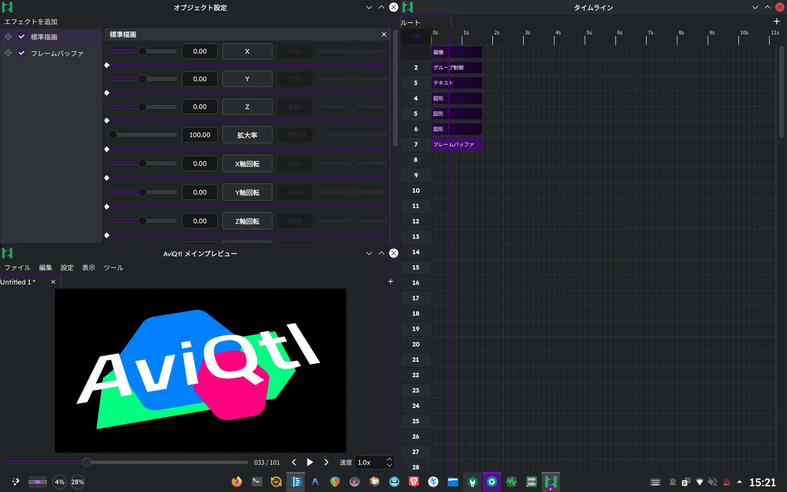

<p align="center">
  
</p>

<p align="center"><b>AviUtlを踏襲し凌駕する次世代動画編集ソフト</b></p>

## 開発終了のお知らせ
### AviQtlは2026年5月末日を持って、開発を終了しました
- 理由は以下のとおりです。
  - Qt Quick独自のレンダリングループとCompute Shaderとの相性が悪く、実装が困難
  - 同様に、ECSとの相性が悪く、最適化が困難
- AviQtlはコミット履歴を含めて`aviqtl`ブランチに移動しました。現在の`main`ブランチには新規に開発しているNeoUtlが置かれています。

### AviQtlによって得られた知見
- QtとFFmpegを使えば、動画編集ソフトの高品質なプロトタイプを高速に実装できる。
- Compute Shaderの開通が難しい為、GPUゼロコピーを目指すならQt Quickベースのプレビュー実装は不適。
- QMLとQSBを用いると、拡張性の高いアーキテクチャを構築できる（少なくともvertとfragは十分に機能する）。

### AviQtlの今後
- 開発リセット直後はコア機能を実装するためプルリクエストをお受けできません。御了承下さい。
- AviQtlのソースコード及び最終バージョン（AviQtl 0.0.95）のリリースは、引き続き[GNU Affero General Public License Version 3 or later](https://www.gnu.org/licenses/agpl-3.0.txt)でライセンスされ、公開を続けます。しかし、動画編集ソフトとしての実用性はありません。AviQtlの今後のアップデートや互換性は保証されません。
- AviQtlのコントリビューターだった[GT-610](https://codeberg.org/GT610)さんが、[AviQtl Plus](https://github.com/GT-610/AviQtl-Plus)としてAviQtlの開発を継続されています。もしAviQtlがお気に召したのであれば、是非AviQtl Plusをご確認下さい。
- 現在の派生状況

  |**NeoUtl:**|新しい技術を採用して作り直している。|
  |---|---|
  |**AviQtl:**|Qt Quickベース。今後更新されない。|
  |**AviQtl Plus:**|AviQtlの派生プロジェクト。|

## AviQtlとは



**AviUtl 1.10** & **ExEdit 0.92**の操作感を踏襲しつつ、**AviUtlを超える性能**を持つ動画編集ソフトを開発するプロジェクトです。

### 主な特徴

- AviUtlに酷似したUI
- GPUを使った**高速で強力なエフェクト**
- VST3やLV2等の**音声エフェクト**に対応
- **Linux**、**Windows**、**macOS**に対応

## インストール手順

1. Linuxの場合、以下の依存関係をインストールします：
   - Qt6全般、LuaJIT、Vulkan実装（Mesa等）、FFmpeg、Carla、libc++
2. [リリースページ](https://codeberg.org/taisho-guy/AviQtl/releases)からお使いのPCに最適なビルドをダウンロードします。
3. ファイルを展開し、`AviQtl` に実行権限を付与して実行します。

> [!NOTE]
> Linuxユーザーの場合、Arch Linux相当の最新環境を要求します。Ubuntu等の他のディストリビューションをご利用の方は、[Distrobox](https://distrobox.it/)でArch Linuxコンテナを作成し、その中でAviQtlを実行することを強く推奨致します。

## ビルド手順

`BUILD.py` は現在の OS からビルドターゲットを自動判定します。通常は `python BUILD.py` だけで実行できますが、手動で指定することも可能です。

共通の準備として、リポジトリをクローンし、必要に応じて仮想環境を作成してください。

```bash
git clone https://codeberg.org/taisho-guy/AviQtl.git
cd AviQtl

# pipでPySide6を用意する場合（推奨）
python3 -m venv .venv
# Linux/macOS/MSYS2: source .venv/bin/activate
# Windows/PowerShell: .venv\Scripts\Activate.ps1
python -m pip install --upgrade pip PySide6
```

<details>
<summary>Linux</summary>

Linux では既定で distrobox/podman コンテナを使用してビルド環境を分離します。

1. **依存関係のインストール**
   - Pacman: `sudo pacman -S --needed distrobox podman python pyside6 git`
   - APT: `sudo apt install distrobox podman python3 python3-pyside6 git`
   - DNF: `sudo dnf install distrobox podman python3 python3-pyside6 git`
2. **ビルド**
   - `python BUILD.py --arch`
3. **実行**
   - `./build/AviQtl`
</details>

<details>
<summary>macOS</summary>

macOS では `BUILD.py` が Homebrew 経由で CMake、Ninja、Qt6 等の依存関係を確認・インストールし、`macdeployqt` と `codesign` を実行して `.app` バンドルを作成します。

1. **依存関係のインストール**
   - `brew install python pyside git`
2. **ビルド**
   - `python BUILD.py --xcode`
3. **実行**
   - `open ./build/AviQtl.app`
</details>

<details>
<summary>Windows (MSYS2)</summary>

1. **依存関係のインストール**
   - `pacman -S git mingw-w64-ucrt-x86_64-pyside6`
2. **ビルド**
   - `python BUILD.py --msys2`
3. **実行**
   - `./build/AviQtl.exe`
</details>

<details>
<summary>Windows (MSVC - 非推奨)</summary>

MSVC ビルドは環境構築の複雑さから非推奨としています。

1. **追加の準備**
   - Visual Studio 2022 Build Tools の C++ ツールセット
   - 公式 Qt の MSVC x64 版（例: `msvc2022_64`）
   - vcpkg（`VCPKG_ROOT` 環境変数で指定可能。見つからない場合は `BUILD.py` が取得を試みます）
2. **ビルド**
   - `python BUILD.py --msvc --qt-dir <Qtインストールディレクトリ>`
   - `--qt-dir` を省略した場合は `QT_MSVC_DIR` 等から自動検出を試みます。
3. **実行**
   - `.\build\AviQtl.exe`
</details>

## Q & A

<details>
<summary>開発のきっかけは？</summary>

### OSの壁
LinuxでAviUtlが動かないことがきっかけです。**AviUtlのためだけにWindows環境を維持し続けること**は受け入れがたいものでした。

### 肥大化したエコシステム
理由は違えど、AviUtlを「仕方なく」使い続けている方は少なくないはずです。長年の拡張によって肥大化した「ハウルの動く城」のようなエコシステムは、不満を抱えながらも手放しにくい存在となっています。

### プロジェクトの目標とミッション
[鹿児島県立甲南高等学校](https://edunet002.synapse-blog.jp/konan/)の課題研究において、この課題を解決すべくAviQtlの独自開発を決意しました。

- **個人的な目標:** Domino、VocalShifter、REAPER、AviUtlをはしごすることなく、Linux上のAviQtlのみで音MADを制作すること。
- **AviQtlのミッション:** AviUtlを「仕方なく」使っている方々の最適解になること。
</details>

<details>
<summary>なぜAviUtlのクローンを開発しているのですか？</summary>

AviQtlは「AviUtlの再発明」ではありません。AviUtlを強く意識していますが、その中身は全く異なります。

| 項目 | AviQtl | ExEdit0 | ExEdit2 |
| :--- | :--- | :--- | :--- |
| 基盤技術 | Qt6 | Win32 API | Win32 API |
| 並列処理モデル | データ駆動型（ECS） | シングルスレッド | マルチスレッド |
| メモリ空間 | 64bit | 32bit (最大4GB) | 64bit |
| プレビュー描画 | Vulkan / Metal / DX12 | GDI | DX11 |
| 音声エンジン | Carla (VST3/LV2等) | 標準機能のみ | 標準機能のみ |
| プラグイン方式 | LuaJIT / C++ / QML / GLSL | Lua / C++ | LuaJIT / C++ |
| 対応OS | Linux, Windows, macOS | Windows | Windows |

AviQtlは構造的な弱点を根本的に解決します：
1. **ECS（Entity Component System）によるデータ指向:** CPUキャッシュ効率を極限まで高め、大量のオブジェクト処理を高速化。
2. **近代的なメモリ管理:** C++23のスマートポインタを採用し、原因不明のクラッシュを構造的に最小化。
3. **UIとレンダリングの分離:** 重い描画中でもタイムライン操作が妨げられず、High-DPI環境でもUIが鮮明に表示されます。
</details>

<details>
<summary>名称やアイコンの由来は？</summary>

名称は「AviUtl」と「Qt」を組み合わせた造語です。
アイコンは、QtとAviUtlのロゴを組み合わせたデザインになっています。

<p align="center">
   +  = 
</p>
</details>

<details>
<summary>AviUtlのプラグインは使えますか？</summary>
いいえ。仕組みが異なるため互換性は有りません。互換レイヤーを実装する予定も有りません。
</details>

## 関連リンク

AviQtlは、多くの素晴らしいプロジェクトの上に成り立っています。

| プロジェクト | ライセンス | 役割 |
| :--- | :--- | :--- |
| AviUtl | 非自由 | リスペクト元 |
| Carla | GPLv2+ | 音声エフェクト（VST3/LV2等）のホスト |
| FFmpeg | GPLv2+ | 動画・音声のデコード / エンコード |
| LuaJIT | MIT | 高速なスクリプトエンジン |
| Qt | GPLv3 | UI/UXフレームワーク |
| Zrythm | AGPLv3 | 音声プラグイン実装の参考 |
| Remix Icon | Remix Icon License | シンボルアイコン |

## ライセンス

AviQtlは[GNU Affero General Public License](https://www.gnu.org/licenses/agpl-3.0.txt)に基づいて公開されています。

AviQtl内で使用されている[Remix Icon](https://remixicon.com/)は[Remix Icon License](https://raw.githubusercontent.com/Remix-Design/RemixIcon/refs/heads/master/License)に基づいて提供されています。
