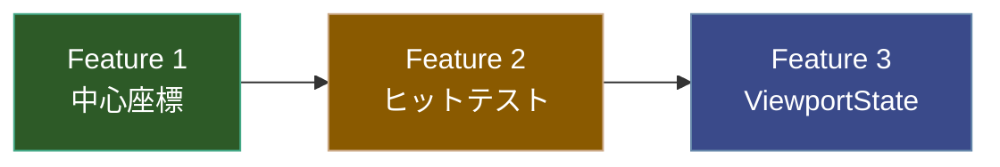

検索結果を統合すると、**AviUtl（無印＋拡張編集）**と**AviUtl2＋ExEdit2**では、同じ「プレビュー領域」でも入力処理の設計が異なります。

ただし、公開資料から取得できるのは仕様・更新履歴・ユーザー検証までで、AviUtl/ExEdit2本体の全内部ソースコードは公開されていません。したがって「内部実装の1命令単位まで100%」ではなく、**公開情報から確定できる仕様を、入力→判定→状態変更→表示結果まで落として言語化**します。特に ExEdit2 は公式ドキュメントを基準にします。([AviUtl2 Modern Docs][1])

# 1. まず「プレビュー領域」が何を指すか

## AviUtl 無印

AviUtl 1.x のメインウィンドウ中央にある映像表示領域です。

拡張編集を使用している場合、ここには現在フレームの合成結果と、選択オブジェクトの編集用表示が出ます。拡張編集はメインウィンドウ上で複数オブジェクトを選択・同時移動できるように拡張されてきました。([Looop Blog][2])

## AviUtl2 / ExEdit2

公式ドキュメントでは、この領域を**「プレビュー編集」**として扱っています。

基本モデルは、

```text
現在フレーム
    ↓
シーンをレンダリング
    ↓
プレビュー表示
    ↓
その上にオブジェクトのアンカー/UIを重ねる
    ↓
マウス入力を対象オブジェクトまたはプレビュー操作へ振り分ける
```

です。([AviUtl2 Modern Docs][1])

---

# 2. ExEdit2の入力処理を状態機械として表す

ExEdit2のプレビュー編集は、単純に

```text
左クリック → 移動
```

ではありません。

概念的には次のような優先順位を持ちます。

```text
マウス入力
 │
 ├─ アンカー上か？
 │      └─ YES → アンカー操作
 │
 ├─ オブジェクト上か？
 │      └─ YES → オブジェクト操作
 │
 ├─ Ctrl + ホイール？
 │      └─ YES → プレビューズーム
 │
 ├─ ホイールボタン + ドラッグ？
 │      └─ YES → プレビュー移動
 │
 ├─ カメラ制御？
 │      └─ YES → カメラ視点操作
 │
 └─ その他
        └─ 右クリックメニュー等
```

これは公開仕様から再構成したモデルです。特に「選択オブジェクトのアンカーを優先する」オプションが beta35 で追加されているため、**アンカーとオブジェクト本体のヒット判定には優先順位が存在する**ことが確認できます。([AviUtl2 Modern Docs][3])

---

# 3. 通常の左ドラッグ

ExEdit2では、プレビューに表示されているオブジェクトをマウスドラッグすると、そのオブジェクトを移動します。([AviUtl2 Modern Docs][1])

つまり、

```text
左ボタン DOWN
    ↓
対象オブジェクトを特定
    ↓
ドラッグ開始位置を保存
    ↓
マウス移動
    ↓
移動量を座標へ変換
    ↓
オブジェクトの座標を変更
    ↓
再描画
    ↓
左ボタン UP
    ↓
操作終了
```

というモデルになります。

重要なのは、**マウス座標そのものをX/Y値にするのではなく、ドラッグによる移動量をオブジェクト座標へ反映する**ことです。

そのため、ドラッグ開始時点のマウス位置とオブジェクト位置の対応を保持する必要があります。

---

# 4. Ctrl + Alt + 左ドラッグ

これは通常移動とは別の操作です。

公式仕様：

> オブジェクト自体を `Ctrl` + `Alt` + ドラッグすると中心座標を移動する

となっています。([AviUtl2 Modern Docs][1])

ここで重要なのは、

```text
位置
```

と

```text
中心座標
```

が別物として扱われている点です。

したがって概念的には、

```text
通常ドラッグ
    → オブジェクト位置を変更

Ctrl + Alt + ドラッグ
    → オブジェクト内部の中心座標を変更
```

です。

これは回転・拡大縮小の基準点を移動する操作として機能します。

---

# 5. Alt + 左ドラッグ

ExEdit2では、

```text
Alt + ドラッグ
```

によってオブジェクトの拡大率を変更できます。([AviUtl2 Modern Docs][1])

さらに現在の公式仕様には例外があります。

> 「サイズ」項目が存在し、移動方法が「移動無し」の場合は、拡大率ではなくサイズを調整する。

つまり入力先は固定ではありません。([AviUtl2 Modern Docs][1])

概念的には、

```text
Alt + drag
    │
    ├─ サイズ項目なし
    │      → 拡大率変更
    │
    └─ サイズ項目あり + 移動無し
           → サイズ変更
```

です。

これは ExEdit2 の入力処理が単なる「マウス→座標」ではなく、**対象オブジェクトのパラメータ構成を見て操作対象を切り替える**ことを示します。

---

# 6. 拡大縮小アンカー

オブジェクトには、編集対象によってアンカーが表示されます。

頂点側の拡大縮小アンカーをドラッグすると、拡大率を変更できます。([AviUtl2 Modern Docs][1])

ここでは、

```text
マウス位置
      ↓
アンカー位置
      ↓
オブジェクト中心からの距離
      ↓
拡大率
```

という幾何学的変換になります。

したがって、オブジェクト本体をドラッグする場合と違って、

```text
Δx, Δy → X, Y
```

ではなく、

```text
中心からの距離
        ↓
スケール
```

という変換が必要になります。

---

# 7. 拡大縮小アンカー + Alt

beta39で追加された操作です。

```text
Alt + 拡大縮小アンカーをドラッグ
```

で、Z軸回転を変更できます。([AviUtl2 Modern Docs][3])

つまりアンカーは、

```text
通常ドラッグ
    → 拡大縮小

Alt + ドラッグ
    → Z軸回転
```

という2つの操作モードを持ちます。

これは入力時の修飾キーを含めてアンカーの操作モードを決定している、と見ることができます。

---

# 8. 回転アンカー

beta39で回転アンカー自体が追加されました。([AviUtl2 Modern Docs][3])

公式仕様では、

```text
回転アンカーをドラッグ
    → オブジェクトを縦横軸で回転

Alt + 回転アンカーをドラッグ
    → 奥行き軸で回転
```

です。([AviUtl2 Modern Docs][1])

さらに、

```text
Alt + 回転アンカーをダブルクリック
```

でオブジェクトを正面に向けます。([AviUtl2 Modern Docs][1])

したがって回転操作は、

| 入力                          | 操作          |
| --------------------------- | ----------- |
| 回転アンカー + Drag               | X/Y軸方向の回転   |
| Alt + 回転アンカー + Drag         | Z/奥行き軸方向の回転 |
| Alt + 回転アンカー + Double Click | 正面を向ける      |

となります。

---

# 9. 「アンカー優先」という重要な仕様

beta35では、

> プレビュー編集で選択オブジェクトのアンカーを優先するオプション

が追加されています。([AviUtl2 Modern Docs][3])

これはプレビュー領域の入力処理を理解する上で重要です。

例えば、

```text
      アンカー
         ●
    ┌────────┐
    │ object │
    └────────┘
```

のようにアンカーがオブジェクト内部に存在する場合、

```text
マウス座標 → オブジェクト本体
```

だけではなく、

```text
マウス座標
    ↓
アンカーのヒット判定
    ↓
対象アンカーが存在？
    ↓
YES → アンカー操作
NO  → オブジェクト操作
```

という処理が必要になります。

この優先順位をユーザー設定にしたものが「選択オブジェクトのアンカーを優先」です。

---

# 10. 選択状態

ExEdit2では、プレビュー上のクリックによるオブジェクト選択も存在します。

また、クリック時にオブジェクトのグループを選択する設定があります。

この設定は beta28 で初期値がOFFに変更されました。([アットウィキ][4])

したがってクリック時の概念モデルは、

```text
クリック位置
    ↓
オブジェクト検索
    ↓
対象オブジェクトを選択
    ↓
設定に応じてグループも選択
```

です。

「グループを選択するか」は常に固定ではありません。

---

# 11. 複数選択

ExEdit2では複数オブジェクトを選択できます。

選択された状態で設定値を変更すると、その設定値は選択されたオブジェクト群に反映されます。([AviUtl2 Modern Docs][1])

そのためプレビューで複数オブジェクトを移動する場合も、内部的には、

```text
選択オブジェクト集合
    ↓
ドラッグ移動量 ΔX, ΔY
    ↓
各オブジェクトへ同じ移動量を適用
```

という構造になります。

---

# 12. Ctrl + マウスホイール

beta28で追加された操作です。

```text
Ctrl + Wheel
```

でプレビューの拡大率を変更します。([アットウィキ][4])

さらに beta47 で、

> マウスホイール操作の拡大縮小時にマウス位置が基準となる

ように変更されました。([AviUtl2 Modern Docs][3])

これは非常に重要です。

単純なズームなら、

```text
scale = scale × factor
```

だけで済みます。

しかし「マウス位置を固定点にする」には、

```text
画面上のマウス位置
        ↓
プレビュー座標へ変換
        ↓
ズーム
        ↓
スクロール位置を補正
```

が必要です。

つまり、

```text
マウス下の映像位置
```

をズーム前後で同じ画面位置に保持します。

この仕様変更は、単なる倍率変更ではなく**ズーム中心を含む2Dビュー変換**を実装していることを示しています。

---

# 13. ホイールボタンドラッグ

beta28で追加されました。

```text
ホイールボタン押下
        +
ドラッグ
        ↓
プレビューをスクロール
```

です。([アットウィキ][4])

これはオブジェクトを動かす操作ではありません。

変更されるのは、

```text
プレビュー表示位置
```

です。

したがって内部モデルは、

```text
オブジェクト座標
    ≠
プレビューのカメラ/ビュー座標
```

になっています。

---

# 14. カメラ制御時の右ドラッグ

カメラ制御対象を編集している場合、右ドラッグでカメラ視点を変更できます。([AviUtl2 Modern Docs][1])

したがって右ドラッグは通常のオブジェクト編集とは別系統です。

概念的には、

```text
通常プレビュー
    右ドラッグ
        → 通常のプレビュー操作/メニュー系

カメラ制御編集
    右ドラッグ
        → カメラ視点操作
```

となります。

---

# 15. 右クリック

プレビュー領域には右クリックメニューがあります。([AviUtl2 Modern Docs][1])

つまり右クリックは、

```text
右ボタン DOWN
    ↓
コンテキストメニュー処理
```

へ分岐します。

ここは左ドラッグとは違い、オブジェクトパラメータを直接変更する入力ではありません。

---

# 16. D&D

プレビュー領域はドラッグ＆ドロップの入力先にもなっています。

公式仕様では、

* メディアファイル
* プロジェクトファイル
* エイリアスファイル `.object`

をD&Dすると、**現在フレーム位置のレイヤーに追加**できます。([AviUtl2 Modern Docs][1])

つまり、

```text
外部ファイル
    ↓ D&D
プレビュー領域
    ↓
現在フレーム
    ↓
現在のレイヤー
    ↓
オブジェクト追加
```

です。

GCMZDropsのようなプラグインも、ExEdit2のプレビュー領域へ `.au2pkg.zip` をD&Dするインストール方式を採用しています。([GitHub][5])

---

# 17. キーボード操作

ここはマウス操作と分離して考える必要があります。

ExEdit2にはショートカットキー設定機構があり、設定画面からキーを変更できます。([AviUtl2 Modern Docs][1])

したがって、

```text
「このキーを押したら必ずこの操作」
```

ではなく、

```text
キー入力
    ↓
ショートカット設定を検索
    ↓
該当コマンド
    ↓
コマンド実行
```

という構造です。

つまりユーザーが変更したショートカット設定によって結果が変わります。

---

# 18. AviUtl無印のキーボードによるオブジェクト操作

無印AviUtl＋拡張編集では、選択オブジェクトに対してテンキーを使った直接操作があります。

| キー   | 動作            |
| ---- | ------------- |
| Num4 | 左へ移動          |
| Num6 | 右へ移動          |
| Num2 | 下へ移動          |
| Num8 | 上へ移動          |
| Num* | 時計回りに22.5°回転  |
| Num/ | 反時計回りに22.5°回転 |
| Num+ | 拡大            |
| Num- | 縮小            |

これらはメインウィンドウ・拡張編集ウィンドウ・設定ウィンドウのいずれからでも操作できると説明されています。([AviUtl入門 - 3日間で覚えるAviUtlの基礎 -][6])

つまり、旧拡張編集ではキーボード操作の入力フォーカスを「プレビュー専用」に限定していません。

---

# 19. AviUtl無印のAlt + ドラッグ

旧AviUtlでは、メインウィンドウ上で

```text
Alt + 左ドラッグ
```

によってオブジェクトを拡大縮小できます。([AviUtl入門 - 3日間で覚えるAviUtlの基礎 -][6])

これはExEdit2の

```text
Alt + ドラッグ → 拡大率/サイズ
```

に近い設計ですが、**同一実装だと考えることはできません**。

ExEdit2ではこの操作が後から追加されており、beta39の更新履歴にも明示されています。([AviUtl2 Modern Docs][3])

---

# 20. フレーム領域外

旧AviUtl/拡張編集では、プレビューに動画フレーム外の領域を表示できます。

標準では、

```text
動画フレーム
┌─────────────┐
│             │
│    映像     │
│             │
└─────────────┘
```

だけですが、フレーム領域外表示を有効にすると、

```text
灰色領域
┌───────────────────┐
│    ┌──────────┐   │
│    │  映像    │   │
│    └──────────┘   │
└───────────────────┘
```

のように、画面外へ移動しているオブジェクトの位置も確認できます。([AviUtlの易しい使い方][7])

旧拡張編集では `V` が標準ショートカットです。([Ocraviutl Fandom][8])

---

# 21. グリッドとスナップ

プレビュー領域にはXY軸グリッドなどの補助表示があります。

旧拡張編集では、

```text
G
```

でXY軸グリッド表示を切り替えられ、`Shift+G` でグリッド設定を開く標準設定があります。([Ocraviutl Fandom][8])

ExEdit2でもXY軸グリッドが追加されています。

さらに beta10 では、**プレビュー編集でオブジェクトの中心座標もスナップ対象**になりました。([アットウィキ][4])

そして beta33 では、Shiftを押しながらアンカーを移動する際のスナップ処理が修正されています。([アットウィキ][4])

したがってアンカー操作は単純な連続座標変更ではなく、

```text
マウス座標
    ↓
変換後の候補座標
    ↓
スナップ条件判定
    ↓
必要ならグリッド/中心等へ補正
    ↓
パラメータ更新
```

という段階を持ちます。

---

# 22. 「マウス座標」と「オブジェクト座標」は同じではない

NeoUtl等で再実装するなら、ここを分離する必要があります。

プレビューには少なくとも、

```text
Screen
  ↓
Preview View
  ↓
Scene
  ↓
Object
```

という座標系を想定できます。

例えば、

```text
マウス座標
    ↓
ウィンドウ座標
    ↓
プレビュー表示座標
    ↓
ズーム・スクロールを逆変換
    ↓
シーン座標
    ↓
オブジェクト変換を逆適用
    ↓
オブジェクトローカル座標
```

です。

これが必要だから、

```text
Ctrl + Wheel
```

の「マウス位置基準ズーム」や、

```text
Alt + Drag
```

の拡大率変更、

```text
Ctrl + Alt + Drag
```

の中心座標変更、

```text
回転アンカー
```

のような異なる操作を同一プレビュー上で成立させられます。

---

# 23. 入力処理の全体像

公開仕様から整理すると、ExEdit2のプレビュー編集は次のようにモデル化できます。

```text
                   ┌──────────────┐
                   │ Mouse / Key  │
                   └──────┬───────┘
                          │
             ┌────────────▼────────────┐
             │ modifier / button判定  │
             └────────────┬────────────┘
                          │
             ┌────────────▼────────────┐
             │ pointer hit test        │
             └────────────┬────────────┘
                          │
       ┌──────────────────┼──────────────────┐
       │                  │                  │
       ▼                  ▼                  ▼
    Anchor             Object             View
       │                  │                  │
       │                  │                  ├─ Ctrl+Wheel
       │                  │                  │    → Zoom
       │                  │                  │
       │                  │                  └─ Wheel Drag
       │                  │                       → Pan
       │                  │
       │                  ├─ Drag
       │                  │    → Position
       │                  │
       │                  ├─ Alt+Drag
       │                  │    → Scale/Size
       │                  │
       │                  └─ Ctrl+Alt+Drag
       │                       → Center
       │
       ├─ Drag
       │    → X/Y rotation
       │
       ├─ Alt+Drag
       │    → Z rotation
       │
       └─ Alt+DoubleClick
            → Face front
```

これはExEdit2公式仕様から組み立てた挙動モデルです。個々の内部関数名や実装アルゴリズムを公開ソースなしに断定したものではありません。([AviUtl2 Modern Docs][1])

---

# 24. 「ユーザーから見える挙動」だけに圧縮すると

### オブジェクト

| 入力                   | 結果                  |
| -------------------- | ------------------- |
| 左ドラッグ                | オブジェクト移動            |
| Ctrl+Alt+左ドラッグ       | 中心座標移動              |
| Alt+左ドラッグ            | 拡大率変更 / 条件によってサイズ変更 |
| アンカーを左ドラッグ           | アンカー固有の編集           |
| アンカー + Alt           | 別軸/別パラメータ操作         |
| 回転アンカー               | 回転                  |
| Alt + 回転アンカー         | 奥行き軸回転              |
| Alt + 回転アンカーをダブルクリック | 正面向き                |

([AviUtl2 Modern Docs][1])

### プレビューそのもの

| 入力                    | 結果               |
| --------------------- | ---------------- |
| Ctrl + ホイール           | ズーム              |
| Ctrl + ホイール（beta47以降） | マウス位置を基準にズーム     |
| ホイールボタン + ドラッグ        | パン               |
| 右クリック                 | コンテキストメニュー       |
| ファイルD&D               | 現在フレーム位置のレイヤーへ追加 |

([AviUtl2 Modern Docs][1])

### キーボード

```text
キー
 ↓
ショートカット設定
 ↓
登録された編集コマンド
 ↓
オブジェクト/フレーム/表示等を操作
```

ExEdit2ではショートカットキーをユーザー設定から変更できます。([AviUtl2 Modern Docs][1])

---

# 25. AviUtl無印 → ExEdit2で何が変わったか

大きく見ると、ExEdit2ではプレビュー入力が**「オブジェクトを動かすだけのGUI」から「ビュー＋オブジェクト＋アンカーを統合した編集GUI」へ拡張**されています。

時系列を見ると明確です。

```text
beta10
  └─ XYグリッド
  └─ 中心座標をスナップ対象

beta21
  └─ アンカー表示改善

beta28
  ├─ Ctrl + Wheel → ズーム
  └─ ホイールボタンDrag → パン

beta35
  ├─ 選択オブジェクトのアンカー優先
  └─ アンカー操作ロック

beta39
  ├─ 回転アンカー
  ├─ Alt + Drag → 拡大縮小
  └─ Alt + アンカーDrag → 回転

beta47
  └─ マウス位置基準ズーム
```

([アットウィキ][4])

この変化から、ExEdit2のプレビュー領域は現在、

```text
Renderer
   +
Object Manipulator
   +
Anchor Manipulator
   +
2D Viewport
   +
Camera Editor
   +
Drop Target
   +
Context Menu Target
```

という複数の入力機能を持つ領域として設計されている、と整理できます。

---

## 重要な結論

AviUtl/ExEdit2のプレビュー操作を実装仕様として一文で表すなら、

> **「現在フレームをレンダリングしたシーンをビューポートとして表示し、その上でヒットテストされたオブジェクトまたはアンカーに対して、マウスボタン・修飾キー・ドラッグ量を操作モードとして解釈し、オブジェクトの位置・中心・サイズ・回転等、またはビューポートのズーム・パンを変更する入力系」**

です。

特にNeoUtlで同等機能を設計するなら、**「マウスイベントごとにif文を追加する」のではなく、`ViewportState → HitTarget → InteractionMode → CoordinateTransform → Command` の5層に分離する**のが、この仕様から自然に導かれる構造です。

なお、ExEdit2の公式ドキュメント自身が現在も「簡易的な操作説明で、細かい説明は今後作成予定」としています。したがって、ここで公開資料から確定できない**内部のヒットテスト順序、座標変換式、スナップアルゴリズム、Undoトランザクション境界、各アンカーの正確な数式**まで「100%確定」とするのは資料上不可能です。([AviUtl2 Modern Docs][1])

[1]: https://docs.aviutl2.jp/usage?utm_source=chatgpt.com "簡易説明 | AviUtl2 Modern Docs"
[2]: https://looooooooop.blog.fc2.com/blog-entry-275.html?utm_source=chatgpt.com "〖AviUtl〗 拡張編集のメジャーアップデート　追記 - ニコニコ動画研究所"
[3]: https://docs.aviutl2.jp/changelog?utm_source=chatgpt.com "更新履歴 | AviUtl2 Modern Docs"
[4]: https://w.atwiki.jp/aviutlexedit2/pages/35.html?utm_source=chatgpt.com "更新履歴 - AviUtl2のWiki | AviUtl ExEdit2の情報をまとめるWiki - atwiki（アットウィキ）"
[5]: https://github.com/oov/aviutl2_gcmzdrops2/blob/main/README.md?utm_source=chatgpt.com "aviutl2_gcmzdrops2/README.md at main · oov/aviutl2_gcmzdrops2 · GitHub"
[6]: https://aviutl.eksd.jp/simpleedit_addtelopandlogo.html?utm_source=chatgpt.com "テロップと透かしロゴを入れる < 簡単な編集をしてみよう | AviUtl入門 - 3日間で覚えるAviUtlの基礎 -"
[7]: https://aviutl.info/honntai-winndou/?utm_source=chatgpt.com "〖AviUtl〗本体ウィンドウの各機能の解説〖全ボタン | タイトルバー意味〗 | AviUtlの易しい使い方"
[8]: https://ocraviutl.fandom.com/ja/wiki/%E6%8B%A1%E5%BC%B5%E7%B7%A8%E9%9B%86?utm_source=chatgpt.com "拡張編集 | OCR & Aviutl Wiki | Fandom"

# プレビュー操作 3機能 実装計画

## 概要

3つの機能はいずれも **独立に実装可能** だが、中心座標（Feature 1）とヒットテスト（Feature 2）はお互いの成果物を消費する関係にある。推奨実装順は **1 → 2 → 3**。

---

## Feature 1: 中心座標移動（Ctrl+Alt+Drag）

### 現状の問題

[`Transform`](file:///home/user/%E3%83%89%E3%82%AD%E3%83%A5%E3%83%A1%E3%83%B3%E3%83%88/Projects/NeoUtl/src/ecs/transform.rs#L6-L16) (ECS側) も [`neoutl.v1.Transform`](file:///home/user/%E3%83%89%E3%82%AD%E3%83%A5%E3%83%A1%E3%83%B3%E3%83%88/Projects/NeoUtl/crates/core/schema/proto/neoutl/v1/common.proto#L4-L14) (protobuf側) も `(x, y, z)` を位置、`(rot_x, rot_y, rot_z)` を回転として持つが、**回転・拡大の中心をオフセットするフィールドがない**。AviUtl本家では「中心X/中心Y/中心Z」がこの役割を果たしている。

### 設計方針

中心オフセットは行列合成の順序を変えるだけで実現できる。現在の `compute_global_matrix` は:

```
M = Translation × RotZ × RotY × RotX × Scale
```

中心オフセット導入後は:

```
M = Translation × T(+cx, +cy, +cz) × RotZ × RotY × RotX × Scale × T(-cx, -cy, -cz)
```

つまり「中心オフセット分移動 → 回転・拡大 → 中心オフセット分戻る」という構造。

### 変更箇所

#### Step 1-1: protobuf スキーマ拡張

**ファイル**: [`common.proto`](file:///home/user/%E3%83%89%E3%82%AD%E3%83%A5%E3%83%A1%E3%83%B3%E3%83%88/Projects/NeoUtl/crates/core/schema/proto/neoutl/v1/common.proto#L4-L14)

```diff
 message Transform {
   float x = 1;
   float y = 2;
   float z = 3;
   float scale_x = 4;
   float scale_y = 5;
   float rot_x = 6;
   float rot_y = 7;
   float rot_z = 8;
   float opacity = 9;
+  float center_x = 10;
+  float center_y = 11;
+  float center_z = 12;
 }
```

> [!NOTE]
> proto3 ではフィールド番号を追加する形は **前方互換**。古いファイルで `center_x/y/z` が存在しなければ protobuf のデフォルト値 `0.0` が使われ、既存の動作と完全に一致する。**ファイル互換性は壊れない。**

#### Step 1-2: ECS側 Transform 拡張

**ファイル**: [`transform.rs`](file:///home/user/%E3%83%89%E3%82%AD%E3%83%A5%E3%83%A1%E3%83%B3%E3%83%88/Projects/NeoUtl/src/ecs/transform.rs)

```diff
 pub struct Transform {
     pub x: f32,
     pub y: f32,
     pub z: f32,
     pub scale_x: f32,
     pub scale_y: f32,
     pub rot_x: f32,
     pub rot_y: f32,
     pub rot_z: f32,
     pub opacity: f32,
+    pub center_x: f32,
+    pub center_y: f32,
+    pub center_z: f32,
 }
```

同時に更新が必要な箇所:
| 箇所 | 内容 |
|---|---|
| [`Default for Transform`](file:///home/user/%E3%83%89%E3%82%AD%E3%83%A5%E3%83%A1%E3%83%B3%E3%83%88/Projects/NeoUtl/src/ecs/transform.rs#L18-L32) | `center_x/y/z: 0.0` 追加 |
| [`ParamAccess for Transform`](file:///home/user/%E3%83%89%E3%82%AD%E3%83%A5%E3%83%A1%E3%83%B3%E3%83%88/Projects/NeoUtl/src/ecs/transform.rs#L34-L64) | `"center_x"` / `"center_y"` / `"center_z"` の get/set 追加 |
| [`From<&Transform> for neoutl_schema::Transform`](file:///home/user/%E3%83%89%E3%82%AD%E3%83%A5%E3%83%A1%E3%83%B3%E3%83%88/Projects/NeoUtl/src/ecs/transform.rs#L131-L145) | 新フィールドのマッピング |
| [`TryFrom<&neoutl_schema::Transform> for Transform`](file:///home/user/%E3%83%89%E3%82%AD%E3%83%A5%E3%83%A1%E3%83%B3%E3%83%88/Projects/NeoUtl/src/ecs/transform.rs#L147-L163) | 新フィールドのマッピング |
| [`transforms_equal`](file:///home/user/%E3%83%89%E3%82%AD%E3%83%A5%E3%83%A1%E3%83%B3%E3%83%88/Projects/NeoUtl/src/ui/preview/interaction.rs#L244-L250) | `center_x/y/z` の比較追加 |

#### Step 1-3: 行列合成の修正

**ファイル**: [`compute_global_matrix`](file:///home/user/%E3%83%89%E3%82%AD%E3%83%A5%E3%83%A1%E3%83%B3%E3%83%88/Projects/NeoUtl/src/ecs/transform.rs#L93-L129)

```rust
pub fn compute_global_matrix(t: &Transform) -> GlobalMatrix {
    // Translation (object position)
    let translation = /* ... 既存の translation 行列 ... */;
    // Center offset: 中心点へ移動
    let center_to: [f32; 16] = [
        1.0, 0.0, 0.0, 0.0,
        0.0, 1.0, 0.0, 0.0,
        0.0, 0.0, 1.0, 0.0,
        t.center_x, t.center_y, t.center_z, 1.0,
    ];
    // Center offset inverse: 中心点から戻る
    let center_from: [f32; 16] = [
        1.0, 0.0, 0.0, 0.0,
        0.0, 1.0, 0.0, 0.0,
        0.0, 0.0, 1.0, 0.0,
        -t.center_x, -t.center_y, -t.center_z, 1.0,
    ];
    // 既存: rotation, scale
    let rotation = mat4_mul(&rot_z, &mat4_mul(&rot_y, &rot_x));
    // 新しい合成順:
    // Translation × CenterTo × Rotation × Scale × CenterFrom
    GlobalMatrix(mat4_mul(
        &translation,
        &mat4_mul(&center_to, &mat4_mul(&rotation, &mat4_mul(&scale, &center_from))),
    ))
}
```

同様に [`compute_relative_matrix`](file:///home/user/%E3%83%89%E3%82%AD%E3%83%A5%E3%83%A1%E3%83%B3%E3%83%88/Projects/NeoUtl/src/ecs/transform.rs#L165-L186) にも同じ修正を適用。

#### Step 1-4: UI — ドラッグ操作追加

**ファイル**: [`interaction.rs`](file:///home/user/%E3%83%89%E3%82%AD%E3%83%A5%E3%83%A1%E3%83%B3%E3%83%88/Projects/NeoUtl/src/ui/preview/interaction.rs)

```diff
 enum ActiveDrag {
     Move { ... },
     Scale { ... },
     Rotate { ... },
+    CenterOffset {
+        object_id: usize,
+        start: Transform,
+    },
 }
```

- `start_drag` 内で **Ctrl+Alt が押されている場合** は `ActiveDrag::CenterOffset` を開始
- `apply_drag` 内で `viewport.screen_delta_to_scene(delta)` を用いて `center_x`, `center_y` を更新
- `commit_drag` の `TransformChangeCommand` は既に汎用なので追加不要

**修飾キー判定** は `response.ctx().input(|i| i.modifiers)` から取得:
```rust
let modifiers = response.ctx().input(|i| i.modifiers);
if modifiers.ctrl && modifiers.alt {
    // CenterOffset drag
}
```

#### Step 1-5: ギズモ — 中心点表示

**ファイル**: [`gizmo.rs`](file:///home/user/%E3%83%89%E3%82%AD%E3%83%A5%E3%83%A1%E3%83%B3%E3%83%88/Projects/NeoUtl/src/ui/preview/gizmo.rs)

中心オフセットが `(0,0,0)` でない場合、原点マーカーに加えて **中心点マーカー**（十字アイコン等）を描画する。中心点のスクリーン座標は `project_object_origin` が返す位置そのもの（Transform原点）。中心点からオフセットされた「回転の中心」はスクリーン上の別の位置になるので、視覚的に区別するためにラインで結ぶ。

#### Step 1-6: プロパティパネル

プロパティパネルに「中心X」「中心Y」「中心Z」のパラメータ行を追加（`ParamAccess` 対応済みのため、キーフレームアニメーション含めて自動的に動作する）。

### ファイル互換性の評価

| シナリオ | 結果 |
|---|---|
| **新バイナリで旧ファイルを読む** | `center_x/y/z` はデフォルト `0.0` → 既存動作と同一 ✅ |
| **旧バイナリで新ファイルを読む** | proto3 は未知フィールドを無視 → `center_x/y/z` が無視されるだけ ✅ |
| **キーフレームトラック** | `ParamAccess` ベースなので `"center_x"` キーが自動対応 ✅ |

---

## Feature 2: オブジェクト外形を用いたヒットテスト・アンカー配置

### 現状の問題

[`hit_test.rs`](file:///home/user/%E3%83%89%E3%82%AD%E3%83%A5%E3%83%A1%E3%83%B3%E3%83%88/Projects/NeoUtl/src/ui/preview/hit_test.rs) はオブジェクトの原点のみで判定しており、アンカーも固定オフセット。描画サイズはメディア種別ごとに異なり、解決ロジックは [`active_query.rs`](file:///home/user/%E3%83%89%E3%82%AD%E3%83%A5%E3%83%A1%E3%83%B3%E3%83%88/Projects/NeoUtl/src/ecs/systems/active_query.rs#L284-L305) 内の `rescale_for_source` 呼び出しに閉じている。

### 設計方針

`active_query.rs` で既にソースサイズの解決を行っているので、**解決済みのソースサイズをキャッシュする新しいECSリソース**を導入し、UIレイヤーから参照できるようにする。

### 変更箇所

#### Step 2-1: ソースサイズキャッシュの導入

**新規ファイル**: `src/ecs/resources/source_size_cache.rs`

```rust
use std::collections::HashMap;

/// 各オブジェクトの解決済みソースサイズ (ピクセル単位)。
/// `get_active_objects_system` の副産物として毎フレーム更新される。
#[derive(Clone, Debug, Default)]
pub struct SourceSizeCache {
    sizes: HashMap<usize, (f32, f32)>,
}

impl SourceSizeCache {
    pub fn clear(&mut self) { self.sizes.clear(); }

    pub fn insert(&mut self, object_id: usize, width: f32, height: f32) {
        self.sizes.insert(object_id, (width, height));
    }

    /// オブジェクトのソースサイズを取得。
    /// メディア: 画像/動画の実ピクセル数
    /// シェイプ: UNIT_SIZE_PX × UNIT_SIZE_PX
    /// テキスト: UNIT_SIZE_PX × UNIT_SIZE_PX (将来的にレイアウト解決が可能なら改善)
    pub fn get(&self, object_id: usize) -> Option<(f32, f32)> {
        self.sizes.get(&object_id).copied()
    }
}
```

#### Step 2-2: `active_query` から `SourceSizeCache` を更新

**ファイル**: [`active_query.rs`](file:///home/user/%E3%83%89%E3%82%AD%E3%83%A5%E3%83%A1%E3%83%B3%E3%83%88/Projects/NeoUtl/src/ecs/systems/active_query.rs#L284-L305)

ソースサイズの解決はすでに行っている（`rescale_for_source` に渡す `w, h`）ので、同じ値を `SourceSizeCache` に書き込む:

```rust
// 既存の rescale_for_source 呼び出しの直前/直後で:
let (source_w, source_h) = match &media_source {
    Some(src) if matches!(src.kind, MediaKind::Video | MediaKind::Image) => {
        neoutl_media_runtime::cache::global()
            .dimensions(&src.path)
            .map(|(w, h)| (w as f32, h as f32))
            .unwrap_or((UNIT_SIZE_PX, UNIT_SIZE_PX))
    }
    _ => match compose_source {
        Some(ComposeSource::NestedScene { target_scene, .. }) => {
            scenes.find(target_scene)
                .map(|s| (s.width as f32, s.height as f32))
                .unwrap_or((UNIT_SIZE_PX, UNIT_SIZE_PX))
        }
        _ => (UNIT_SIZE_PX, UNIT_SIZE_PX),
    },
};
source_size_cache.insert(object_id, source_w, source_h);
```

`SourceSizeCache` は `EcsWorld` の Unique リソースとして管理し、`get_active_objects_system` の返り値に含めるか、またはEcsWorldに直接格納して後から参照可能にする。

#### Step 2-3: 4隅の投影ヘルパー

**ファイル**: [`projection.rs`](file:///home/user/%E3%83%89%E3%82%AD%E3%83%A5%E3%83%A1%E3%83%B3%E3%83%88/Projects/NeoUtl/src/ui/preview/projection.rs)

```rust
/// オブジェクトのソースサイズに基づく4隅をスクリーン座標へ投影する。
pub fn project_object_corners(
    world: &EcsWorld,
    object_id: usize,
    source_w: f32,
    source_h: f32,
    image_rect: egui::Rect,
) -> Option<[egui::Pos2; 4]> {
    let transform = world.get_transform(object_id)?;
    let global = compute_global_matrix(&transform);
    let cam = world.world.run(|cam: UniqueView<Camera>| *cam);
    let proj = world.get_project();
    let proj_width = proj.width.max(1) as f32;
    let proj_height = proj.height.max(1) as f32;

    let mvp = compute_mvp(&global, &cam, proj_width, proj_height,
        Projection::Perspective { fov_deg: cam.fov_deg });

    // ローカル空間の4隅 (UNIT_SIZE_PX=1.0ベース、ソースサイズでスケール)
    let hw = source_w * 0.5 / UNIT_SIZE_PX;  // rescale_for_source と同じ変換
    let hh = source_h * 0.5 / UNIT_SIZE_PX;
    let corners = [
        [-hw, -hh, 0.0], [ hw, -hh, 0.0],
        [ hw,  hh, 0.0], [-hw,  hh, 0.0],
    ];

    let mut result = [egui::Pos2::ZERO; 4];
    let scale = image_rect.width() / proj_width;
    for (i, &[lx, ly, lz]) in corners.iter().enumerate() {
        let clip = transform_point(&mvp, [lx, ly, lz, 1.0]);
        if clip[3].abs() < 1e-6 { return None; }
        let ndc_x = clip[0] / clip[3];
        let ndc_y = clip[1] / clip[3];
        let px = (ndc_x * 0.5 + 0.5) * proj_width;
        let py = (1.0 - (ndc_y * 0.5 + 0.5)) * proj_height;
        result[i] = egui::pos2(
            image_rect.left() + px * scale,
            image_rect.top()  + py * scale,
        );
    }
    Some(result)
}
```

#### Step 2-4: ヒットテストの改善

**ファイル**: [`hit_test.rs`](file:///home/user/%E3%83%89%E3%82%AD%E3%83%A5%E3%83%A1%E3%83%B3%E3%83%88/Projects/NeoUtl/src/ui/preview/hit_test.rs)

```rust
// オブジェクト選択: 原点距離判定 → 投影矩形内判定に変更
fn point_in_quad(p: egui::Pos2, corners: &[egui::Pos2; 4]) -> bool {
    // 凸四角形に対するクロス積テスト (2D)
    let mut sign = None;
    for i in 0..4 {
        let a = corners[i];
        let b = corners[(i + 1) % 4];
        let cross = (b.x - a.x) * (p.y - a.y) - (b.y - a.y) * (p.x - a.x);
        let s = cross > 0.0;
        match sign {
            None => sign = Some(s),
            Some(prev) if prev != s => return false,
            _ => {}
        }
    }
    true
}
```

ヒットテスト関数の変更:
- `hit_test` に `SourceSizeCache` を引数として追加
- `project_object_origin` による距離判定を `project_object_corners` + `point_in_quad` に置き換え
- フォールバック: ソースサイズが不明な場合は従来の原点距離判定を維持

#### Step 2-5: アンカー配置の改善

**ファイル**: [`hit_test.rs`](file:///home/user/%E3%83%89%E3%82%AD%E3%83%A5%E3%83%A1%E3%83%B3%E3%83%88/Projects/NeoUtl/src/ui/preview/hit_test.rs#L27-L38)

```rust
pub fn anchor_screen_pos(
    world: &EcsWorld,
    object_id: usize,
    image_rect: egui::Rect,
    kind: AnchorKind,
    source_size_cache: &SourceSizeCache,
) -> Option<egui::Pos2> {
    let origin = project_object_origin(world, object_id, image_rect)?;
    // 矩形が取得できればコーナー基準、なければ固定オフセット (フォールバック)
    if let Some((sw, sh)) = source_size_cache.get(object_id) {
        if let Some(corners) = project_object_corners(world, object_id, sw, sh, image_rect) {
            return Some(match kind {
                AnchorKind::Scale => {
                    // 右下コーナー
                    corners[2]
                }
                AnchorKind::Rotate => {
                    // 上辺中央
                    let mid_top = egui::pos2(
                        (corners[0].x + corners[1].x) * 0.5,
                        (corners[0].y + corners[1].y) * 0.5,
                    );
                    let dir = (mid_top - origin).normalized();
                    mid_top + dir * 16.0  // 少し外側に配置
                }
            });
        }
    }
    // フォールバック: 固定オフセット
    Some(match kind {
        AnchorKind::Scale => origin + egui::vec2(ANCHOR_OFFSET_PX, ANCHOR_OFFSET_PX),
        AnchorKind::Rotate => origin + egui::vec2(0.0, -ANCHOR_OFFSET_PX),
    })
}
```

#### Step 2-6: ギズモ — 矩形表示

**ファイル**: [`gizmo.rs`](file:///home/user/%E3%83%89%E3%82%AD%E3%83%A5%E3%83%A1%E3%83%B3%E3%83%88/Projects/NeoUtl/src/ui/preview/gizmo.rs)

4隅が取得できる場合は矩形の辺を描画:
```rust
if let Some(corners) = project_object_corners(world, id, sw, sh, image_rect) {
    for i in 0..4 {
        painter.line_segment(
            [corners[i], corners[(i + 1) % 4]],
            egui::Stroke::new(1.0, line_color),
        );
    }
}
```

### API変更の波及範囲

`anchor_screen_pos` と `hit_test` の引数に `SourceSizeCache` が追加されるため、以下の呼び出し元を更新:
- [`interaction.rs`](file:///home/user/%E3%83%89%E3%82%AD%E3%83%A5%E3%83%A1%E3%83%B3%E3%83%88/Projects/NeoUtl/src/ui/preview/interaction.rs#L85) — `hit_test` 呼び出し
- [`gizmo.rs`](file:///home/user/%E3%83%89%E3%82%AD%E3%83%A5%E3%83%A1%E3%83%B3%E3%83%88/Projects/NeoUtl/src/ui/preview/gizmo.rs#L23) — `anchor_screen_pos` 呼び出し
- [`mod.rs`](file:///home/user/%E3%83%89%E3%82%AD%E3%83%A5%E3%83%A1%E3%83%B3%E3%83%88/Projects/NeoUtl/src/ui/preview/mod.rs#L704-L710) — `gizmo::draw` 呼び出し

---

## Feature 3: 移動操作のカメラ変換対応（ViewportState）

### 現状の問題

[`ViewportState`](file:///home/user/%E3%83%89%E3%82%AD%E3%83%A5%E3%83%A1%E3%83%B3%E3%83%88/Projects/NeoUtl/src/ui/preview/viewport.rs) は `Camera::for_resolution` が生成する **既定カメラ** のみを前提とし、スクリーン座標→シーン座標の変換を `scene_width / image_rect_width` の等倍アフィンとしている。カメラオブジェクトが有効な場合、z=0 平面への投影比率が変わるため移動量がずれる。

### 設計方針

スクリーン座標のデルタをシーン座標の z=0 平面上のデルタに正確に変換するには、**カメラの View-Projection 行列の逆行列** を用いて「スクリーン上の2点を z=0 平面にアンプロジェクト → 差分」を計算する。

### 変更箇所

#### Step 3-1: 逆行列ユーティリティ

**ファイル**: [`transform.rs`](file:///home/user/%E3%83%89%E3%82%AD%E3%83%A5%E3%83%A1%E3%83%B3%E3%83%88/Projects/NeoUtl/src/ecs/transform.rs) に `mat4_inverse` を追加

4×4行列の逆行列は長いが定型的な計算。既存の `mat4_mul` の隣に配置。

```rust
pub fn mat4_inverse(m: &[f32; 16]) -> Option<[f32; 16]> {
    // cofactor expansion (標準的な 4x4 逆行列)
    // det が 0 に近い場合は None を返す
    ...
}
```

#### Step 3-2: ViewportState の拡張

**ファイル**: [`viewport.rs`](file:///home/user/%E3%83%89%E3%82%AD%E3%83%A5%E3%83%A1%E3%83%B3%E3%83%88/Projects/NeoUtl/src/ui/preview/viewport.rs)

```rust
#[derive(Clone, Copy, Debug)]
pub struct ViewportState {
    image_rect: egui::Rect,
    scene_width: f32,
    scene_height: f32,
    inv_vp: Option<[f32; 16]>,  // View-Projection の逆行列
}
```

新しいコンストラクタ:
```rust
impl ViewportState {
    pub fn new(
        image_rect: egui::Rect,
        scene_width: u32,
        scene_height: u32,
        camera: &Camera,
    ) -> Self {
        let sw = scene_width.max(1) as f32;
        let sh = scene_height.max(1) as f32;
        let view = compute_view_matrix(camera);
        let aspect = sw / sh;
        let proj = compute_perspective_matrix(camera.fov_deg, aspect, camera.near, camera.far);
        let vp = mat4_mul(&proj, &view);
        let inv_vp = mat4_inverse(&vp);
        Self {
            image_rect,
            scene_width: sw,
            scene_height: sh,
            inv_vp,
        }
    }

    /// スクリーン座標を z=0 平面上のシーン座標にアンプロジェクトする
    fn unproject_to_z0(&self, screen_pos: egui::Pos2) -> Option<(f32, f32)> {
        let inv_vp = self.inv_vp?;
        // screen → NDC
        let scale = self.scene_width / self.image_rect.width().max(1.0);
        let px = (screen_pos.x - self.image_rect.left()) * scale;
        let py = (screen_pos.y - self.image_rect.top()) * scale;
        let ndc_x = (px / self.scene_width) * 2.0 - 1.0;
        let ndc_y = 1.0 - (py / self.scene_height) * 2.0;
        // NDC → 2 world points at different depths
        let near_clip = transform_point(&inv_vp, [ndc_x, ndc_y, -1.0, 1.0]);
        let far_clip  = transform_point(&inv_vp, [ndc_x, ndc_y,  1.0, 1.0]);
        if near_clip[3].abs() < 1e-6 || far_clip[3].abs() < 1e-6 { return None; }
        let near = [near_clip[0]/near_clip[3], near_clip[1]/near_clip[3], near_clip[2]/near_clip[3]];
        let far  = [far_clip[0]/far_clip[3],   far_clip[1]/far_clip[3],   far_clip[2]/far_clip[3]];
        // ray-plane intersection at z=0
        let dz = far[2] - near[2];
        if dz.abs() < 1e-6 { return None; }
        let t = -near[2] / dz;
        Some((near[0] + t * (far[0] - near[0]),
              near[1] + t * (far[1] - near[1])))
    }

    pub fn screen_delta_to_scene(&self, delta: egui::Vec2) -> (f32, f32) {
        // 可能なら逆投影ベースの正確な変換
        let center = self.image_rect.center();
        let p0 = center;
        let p1 = center + delta;
        if let (Some((x0, y0)), Some((x1, y1))) = (
            self.unproject_to_z0(p0),
            self.unproject_to_z0(p1),
        ) {
            return (x1 - x0, y1 - y0);
        }
        // フォールバック: 既定カメラ前提の等倍変換
        let scale = self.scale();
        (delta.x * scale, -delta.y * scale)
    }
}
```

#### Step 3-3: ViewportState 生成時にカメラを渡す

**ファイル**: [`mod.rs`](file:///home/user/%E3%83%89%E3%82%AD%E3%83%A5%E3%83%A1%E3%83%B3%E3%83%88/Projects/NeoUtl/src/ui/preview/mod.rs#L703)

```diff
-let viewport = ViewportState::new(image_rect, res_w, res_h);
+let viewport = {
+    let world_holder = app_state::active_world(state);
+    let world = world_holder.lock().unwrap();
+    let cam: Camera = world.world.run(|cam: UniqueView<Camera>| *cam);
+    ViewportState::new(image_rect, res_w, res_h, &cam)
+};
```

> [!IMPORTANT]
> 現時点では **グローバルカメラ (Unique) のみ** を使用する。レイヤー別カメラやグループ内カメラの影響下にあるオブジェクトの移動は、厳密にはそのカメラの VP 逆行列が必要だが、`resolve_camera` がカーテンチェーン全体を必要とするため、Phase 1 では対応しない。コメントにその旨を残す。

### 影響範囲

- `ViewportState::new` のシグネチャ変更により、[`mod.rs`](file:///home/user/%E3%83%89%E3%82%AD%E3%83%A5%E3%83%A1%E3%83%B3%E3%83%88/Projects/NeoUtl/src/ui/preview/mod.rs#L703) の呼び出し元1箇所を更新
- `screen_delta_to_scene` のインターフェースは変更なし（既存の `interaction.rs` はそのまま動作）

---

## 実装順序とリスク



| Feature | リスク | 軽減策 |
|---|---|---|
| **F1: 中心座標** | proto スキーマ変更 → SDK更新が必要、プロパティUIへの連携 | proto3 の前方互換性により安全。SDK は `center_x/y/z` を re-export するだけ |
| **F2: ヒットテスト** | メディアキャッシュが未ロードの場合サイズが取れない | フォールバック（原点距離判定）を常に残す |
| **F3: ViewportState** | 4x4逆行列の精度、レイヤー別カメラ未対応 | デフォルトカメラでは既存と完全互換。逆行列失敗時はフォールバック |

## 変更ファイル一覧

| ファイル | F1 | F2 | F3 |
|---|:---:|:---:|:---:|
| `proto/neoutl/v1/common.proto` | ✏️ | | |
| `src/ecs/transform.rs` | ✏️ | | ✏️ |
| `src/ecs/world/transform.rs` | | | |
| `src/ecs/resources/` (新規: `source_size_cache.rs`) | | 🆕 | |
| `src/ecs/systems/active_query.rs` | | ✏️ | |
| `src/ecs/systems/types.rs` | | | |
| `src/ui/preview/viewport.rs` | | | ✏️ |
| `src/ui/preview/projection.rs` | | ✏️ | |
| `src/ui/preview/hit_test.rs` | | ✏️ | |
| `src/ui/preview/interaction.rs` | ✏️ | ✏️ | |
| `src/ui/preview/gizmo.rs` | ✏️ | ✏️ | |
| `src/ui/preview/mod.rs` | | ✏️ | ✏️ |
